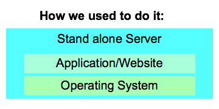
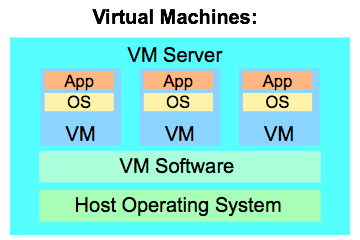

```{r setup, include=FALSE}
options(htmltools.dir.version = FALSE)
```
class: center, middle


Welcome to BCB420 Spring 2020 - <br>
Computational System Biology
<br><br>
Instructor : Ruth Isserlin
<br><br>
TA : Owen Whitley

???

---

# Course Overview

* Brief Introduction<br>
* Course aims<br>
* Marking breakdown<br>
* Where to find all information pertaining to the course<br>
* Quiz - January 21,2020 (Mock Quiz - January 14)<br>
* Wiki and Journal<br>
* Assignment #1 - Due January 28, 2020<br>
* Docker<br>

---

class: center
# Introduction

I am a Bioinformatician in [Gary Bader's lab]() <br><br>
--
I have been at  for over 20 years<br><br>
--
I have been working in the field of bioinformatics for almost the same amount of time. <br><br>
--
I have worked with varying types of data including protein-protein interaction data, genomics, proteomics, metabolomics, methylation .... ,<br><br>

--
I have worked with many different programming languages including c, Perl, java, python,matlab, R, good old bash...<br><br>

--
What I have learned over all my years in bioinformatics is:<br><br> 

--
The data **will** change, <br>
--
the methods **will** evolve and require **increasing amounts of resources**,<br>
--
but it will always come down to mapping identifiers :)
---

# Course Aims

What is Computational Systems Biology?<br><br>
--
According to the U of T course description: <br><br>
.center["Current approaches to using the computer for analyzing and modeling biology as integrated molecular systems."]<br><br>

--

According to [Nature](https://www.nature.com/)'s 2002 article [Computational Systems Biology](Kitano, H. Computational systems biology. Nature 420, 206–210 (2002) doi:10.1038/nature01254) is:<br><br>
.center["To understand complex biological systems requires the integration of experimental and computational research — in other words a systems biology approach. Computational biology, through pragmatic modelling and theoretical exploration, provides a powerful foundation from which to address critical scientific questions head-on."]<br>

---
class: left

# Course Aims

So, what are **we** going to be covering during this course?<br>


* Everyone is going to find and claim an unique -omics expression dataset.
* We will then normalize and clean the dataset
* We will then perform differential expression analysis on the dataset.
* We will the conduct pathway and network analysis on the dataset in order to visualize and interpret it. 

---
class: left

#Marking Breakdown

| Item | Weight | Due Date |
| --- | --- | --- |
| initial set up | 5 marks | January 10, 2020 |
| Quiz on preparatory material | 20 marks | January 21, 2020 |
| Assignment 1 | 20 marks | February 4, 2020 |
| Assignment 2 | 20 marks | March 3, 2020 |
| Assignment 3 | 20 marks | March 24, 2020 |
| Journal/Insights | 15 marks | On going. |
| Total | 100 marks | - |


---
class: center
background-image: url(./images/course_setup.png)
background-size: contain
# Course Set up 

---
class: left
# Course Set up - cont'd

The initial course set up is outlined [here](https://github.com/bcb420-2020/General_Course_Info/wiki#Initial_set_up) and will count for 5 marks of your grade.  It is due **Friday January 10,2020 by 5:00 PM**

## Step 1 

In order to get started you need to get added to the [bcb420-2020 organization](https://github.com/bcb420-2020).<br>
Enter an  issue:<br><li>https://github.com/bcb420-2020/Student_Wiki/issues</li> -  containing your github username that needs to be added to the organization<br>.

---
#Course Set up - cont'd

## Step 2

Everyone in the course will have a repository in the [bcb420-2020 organization](https://github.com/bcb420-2020) that belongs to them.  This repo is where you will submit all your assignments and maintain your own journal as a wiki associated with the repo.<br>  
Once your repo has been set up you need to:<br>
1. Start your course journal - there is a sample student repo with a sample journal posting that can be found [here](https://github.com/bcb420-2020/ExampleStudent/wiki).
1.  Start going through the preparatory material - start [here](https://bcb420-2020.github.io/General_course_prep/)
1.  Follow the remaining steps outlined in the [initial assignment](https://github.com/bcb420-2020/General_Course_Info/wiki#Initial_set_up)

---
# Course Set up - cont'd

## Step 3
* Look through the information on the main course page - [Main course website](https://github.com/bcb420-2020/General_Course_Info/wiki) 
* Make sure you add the links to your journal  to the [Main Student wiki](https://github.com/bcb420-2020/Student_Wiki/wiki) 

---
class: center
# Course discussions

<font size=10>Which platform do you prefer to have class discussions in?</font> <br><br>

<font size=10>Google groups or Quercus </font> <br><br>

<font size=10>fill in the survey here - https://forms.gle/QAfcA56EbgiFx4Hs9 </font> <br><br>

---
class: left
# Quiz

<font size=12> The quiz is worth 20 marks</font>

The purpose of the quiz is to make sure we are all starting on the same page.  You are expected to already be familiar with R so this should just be a refresher.  <br><br>
All the [preparatory material](https://github.com/bcb420-2020/General_Course_Info/wiki#Preparatory_Materials_and_Prerequisites) will be on the quiz.<br><br>  
Going through all the tasks in https://bcb420-2020.github.io/R_basics/ is good preparation for the quiz. <br><br>
We will have a mock quiz next week, **January 14, 2020 during class**.  We will then review and discuss the quiz after it is complete so everyone knows what to expect for the real quiz on **January 21, 2020 during class**

---
class: left
# Wiki

* In past iterations of this course the wiki used was hosted on [Prof. Steipe's personal wiki](http://steipe.biochemistry.utoronto.ca/abc/index.php/Computational_Systems_Biology_Main_Page). **Please feel free to look at the material that is there. There isa lot of great background and refresher information there.**
* We will be using github wikis for this course.  **They do not have the same rich feature set that is available in mediawiki** 
* Every student will maintain their own wiki in their own repository but you can also add links and content to the main [Student wiki](https://github.com/bcb420-2020/Student_Wiki/wiki) and are encouraged to do so. 
* There is a section in the preparatory material that discusses [Wiki](https://bcb420-2020.github.io/General_course_prep/wiki.html).  It is geared to MediaWiki.  You can set github wiki to recognize the MediaWiki format but it might not recognize all features (for example, templates.  I placed the copyright information as a footer of my wiki instead. )

---
class: left
# Journal

* **Main purpose** : to develop good habits. 
* Things to remember:
  * Often the person we are writing notes for is our future selves when we revisit a project, need to write up all the details of a given project for publication.
  * data transformations, parameters, code version are good details to include.
  * Errors that you encountered and how you fixed them! **They will come up again.  I guarentee it!**
* **Course Journal**:
  * Put your journal in the wiki of your course repo.
  * Make each entry its own page in the wiki.
  * Give the page a meaningful name
  * On the main page of your wiki link to all your added journal pages.  Feel free to organise them as you see fit but remember we will be looking through these notes so don't just put journal entry 1, journal entry 2.... 
* See [journal course prepratory material](https://bcb420-2020.github.io/General_course_prep/journal.html) for more details and template of a journal entry. 

---
class: left
# Assignment #1

* **Due January 28,2020 **
* Outline on the course wiki [here](https://github.com/bcb420-2020/General_Course_Info/wiki/Assignment%231)<br><br>
* **Overview** : 
  * <font size=12>Choose a dataset,</font> 
  * <font size=12>get to know it,</font>  
  * <font size=12>claim it, and </font> 
  * <font size=12>clean it</font> <br><br>
* We will be going over an example dataset in week 2 and week 3 of class as well. 

---

class: left
# Example Scenario (based on true events)
  * Imagine this situation - 
    * You are processing some expression dataset and you are 95% complete 
--

    * In a seminar you recently attended you saw a new way to visualize the same data that you are using that looked amazing!  
--

    * And who doesn't love a pretty visual representation.  
--

    * You want to add a new plot to your current pipeline.<br>
--

  * When you go to install **package_new** unfortunately it says that you need a newer version of R...<br>
--

  * But you really want to add this new plot! **Should you update R in order to install this new package?**<br>
--

.center[]
  
---
class: left
# Example Scenario - cont'd

  * You install a newer version of R.<br>
--

.center[]
--

  * You run your current pipeline again.<br>
--

  * Sorry can't find package12 or package21 ....<br>
--

.center[]

---
class: left
# Example Scenario - cont'd

  * You notice that you never added the install statements to your script for those 2 packages that you added a few months back that helps with process x of your pipeline.  

--
  * You add the install statements now.  

--

  * **See it was good that I updated R.  Caught some bugs**

.center[]

---
class: left
# Example Scenario - cont'd

  * You re-run your pipeline with your added **package-new** and your new beautiful cutting edge plot and everything runs smoothly.

--

.center[]

--
  * You go through your original results but something doesn't look right!

--
  * **Those weren't your results!** 

--
.center[]

---
class: left 

# What happened

What could have happened here? **Ideas**?<br>

--

  * you installed the latest package-y but were previously using version 1.2.  
  * from version 1.2 to 1.3 they made a change to algorithm x that changed your results slightly.<br>
  
--

Truthfully lots could have happened. Especially when you are using multiple packages and multiple parts of your analysis.  

---
class: left 

# How could we have done this differently?

* Any ideas?

---
class: center, middle


---

class: left

#Docker
* What is Docker?<br>

--

  * [Docker](https://www.docker.com/) is a container platform similiar to the virtual machine but better. <br>

--

* Why is Docker **great** for Bioinformatics?<br>
  * allows you to create environments to run bioinformatis pipelines.<br>
  
--
  * create a consist environment to use for your pipelines. <br>

--
  * test modifications to the pipeline without disrupting your current set up.<br>
  

---
class: left, middle

.pull-left[

]

--

.pull-right[
* Expensive
* Moving App to new system requires build a whole new server
* Potential wasted resources
* When you out grow the system is difficult to add resources.
]

.footnote[
*slide based [Introduction to docker - 2017](https://www.slideshare.net/Docker/introduction-to-docker-2017) slideshare (slide 16-26)
]
---

class: left, middle

.pull-left[

]

--

.pull-right[
**Pros**<br>
* Better resource usage
* easier to scale
* encapsulation of app/website<br>
<br>
**Cons**<br>
* Each VM still needs to be allocated CPUs, RAM, storage, operating system
* The more VMs you have the more resources you need.
* Portability not guarenteed but definitely easier than the old school individual server model
]

.footnote[
*slide based [Introduction to docker - 2017](https://www.slideshare.net/Docker/introduction-to-docker-2017) slideshare (slide 16-26)
]
---

class: left, middle

.pull-left[

]

.pull-right[

]

A VM encapsulates a server  whereas a Container encapsulates an application or service.

.footnote[
* from the docker [getting started guide](https://docs.docker.com/get-started/)
]

---

# Crash course on docker

Where to start:
  * Docker - [getting started guide](https://docker-curriculum.com/)
  * [Docker hub](https://hub.docker.com/) - repository of docker images
  
Instances we will be using:
  * Rocker - a docker instance configured to run R and Rstudio and various other flavours.  There are different base packages that contain different sets of R packages as default
    * [main rocker page](https://www.rocker-project.org/)
    * [rocker github repo](https://github.com/rocker-org/rocker)
    * [rocker on docker hub](https://www.rocker-project.org/)
  * Bioc - a docker instance configured to run R and contain different sets of commonly used Bioconductor packages.
    * [Main bioc docker page](https://www.bioconductor.org/help/docker/)
    * [bioconductor github repo](https://github.com/Bioconductor/bioc_docker) - there is some good starter notes here as well on how to set up your bioc container.
    * [bioconductor on docker hub](https://hub.docker.com/u/bioconductor/)

---

class: left

# Docker Basics

## Container
  * An instance of an image.
  * There can be multiple containers derived from the same image.
  * if you need to update it simply rebuild the image and relaunch a new container.

--

## Image
  * An image is basically the container blueprint.  It contains everything the container needs to run.

---
class: left

# Docker Basics - cont'd

## Dockerfile
  * A description of everything that is needed for the image
  * A set of commands to create the image
  * Contains commands:
    * FROM - which operatiing system to start from.  What is your base.
    * RUN - execute a given command
    * COPY - copy local files into the new container
    * CMD - to specify default parameters for the container
    * ENTRYPOINT - specify scripts to be run at image creation

---
class: left

# Example Dockerfile 

```{r eval=FALSE}
FROM bioconductor/release_core2:R3.6.0_Bioc3.9 #<<

# Install required packages
RUN install2.r \
    -d TRUE -e \
    -r "https://cran.rstudio.com" \
    -r "http://www.bioconductor.org/packages/release/bioc" \
    TCGAbiolinks \
    RTCGAToolbox 

#install additional packages
RUN install2.r \
   -d TRUE \
   -r "https://cran.rstudio.com" \
   -r "http://www.bioconductor.org/packages/release/bioc" \
   RColorBrewer@1.1-2 \
   GEOquery@2.52.0 \
   BiocGenerics@0.30.0

```

--
* Define the operating system or the base to build upon.

---
class: left

# Example Dockerfile - cont'd

```{r eval=FALSE}
FROM bioconductor/release_core2:R3.6.0_Bioc3.9 

# Install required packages #<<
RUN install2.r \#<<
    -d TRUE -e \#<<
    -r "https://cran.rstudio.com" \#<<
    -r "http://www.bioconductor.org/packages/release/bioc" \#<<
    TCGAbiolinks \#<<
    RTCGAToolbox #<<

#install additional packages
RUN install2.r \
   -d TRUE \
   -r "https://cran.rstudio.com" \
   -r "http://www.bioconductor.org/packages/release/bioc" \
   RColorBrewer@1.1-2 \
   GEOquery@2.52.0 \
   BiocGenerics@0.30.0

```

--
* Install latest versions of a given pakage.

---

# Example Dockerfile - cont'd

```{r eval=FALSE}
FROM bioconductor/release_core2:R3.6.0_Bioc3.9 

# Install required packages
RUN install2.r \
    -d TRUE -e \
    -r "https://cran.rstudio.com" \
    -r "http://www.bioconductor.org/packages/release/bioc" \
    TCGAbiolinks \
    RTCGAToolbox 

#install additional packages
RUN install2.r \ #<<
   -d TRUE \ #<<
   -r "https://cran.rstudio.com" \ #<<
   -r "http://www.bioconductor.org/packages/release/bioc" \ #<<
   RColorBrewer@1.1-2 \ #<<
   GEOquery@2.52.0 \ #<<
   BiocGenerics@0.30.0 #<<

```

--
* Install specific version of a package.  

---
class: left

# Docker Basics - Cont'd

## Volumes
  * Files written to a directory on the container will not remain on the container once it has been stopped.  
  * But keeping files between runs and sharing information between containers is very useful. 
  * volumes offer a mechanisms to store results from a container.  Mapping a drive from the host machine to a drive on the container.  Files written to the mapped drive on the container will persist on the host machine.
  * Volumes are defined at runtime when the container is initially created.
  

--
```{r eval = FALSE}
docker run -e PASSWORD=bcb420_pass 
    -p 8787:8787 
    -v "$(pwd)"/bcb420_course_work:/home/rstudio/projects #<<
    bcb420_image_base
```

---
class: left

## Port forwarding

* By default the container is self contained, with no communication with the host or any other containers.
* In order to open communication you can map a port in the container to the host.

--
```{r eval = FALSE}
docker run -e PASSWORD=bcb420_pass 
    -p 8787:8787 #<<
    -v "$(pwd)"/bcb420_course_work:/home/rstudio/projects 
    bcb420_image_base
```

--

* To access the container:
  * Open a browser and go to localhost:8787
  
---
class: left

# Conclusions
  * If we return to our starting example.  How would docker have helped the situation?
  
