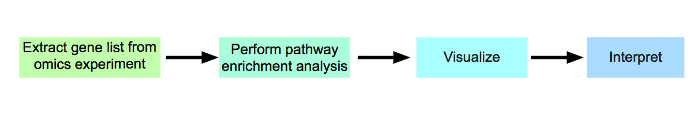
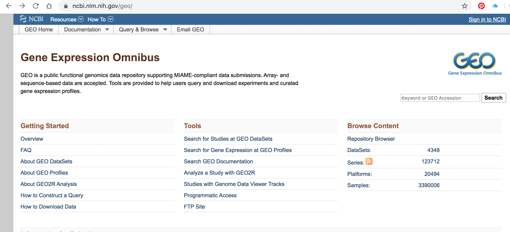

# Before we start

* Docker - feed back, questions?
  * Takes forever to build.  So now that we have tried out creating our own docker I have set up a base image you can use for your assignments
  * [docker hub bcb420-base-image](https://hub.docker.com/repository/docker/risserlin/bcb420-base-image) -- will update image in the next few days because bioc is changing the way they manage their images.  see [here](https://stat.ethz.ch/pipermail/bioc-devel/2020-January/016026.html)
  * **Windows home** - upgrade to Windows education<br><br>
```{r eval=FALSE}
docker run -e PASSWORD=changeit --rm -p 8787:8787 risserlin/bcb420-base-image
```


---

```{r setup, include=FALSE}
options(htmltools.dir.version = FALSE)

if (!requireNamespace("BiocManager", quietly = TRUE))
    install.packages("BiocManager")

if (!requireNamespace("GEOmetadb", quietly = TRUE))
    BiocManager::install("GEOmetadb")

if (!requireNamespace("ggplot2", quietly = TRUE))
    install.packages("ggplot2")

if (!requireNamespace("kableExtra", quietly = TRUE))
    install.packages("kableExtra")

library(ggplot2)
library(kableExtra)
library(GEOmetadb)
library(GEOquery)
```
class: middle

# Overview

* <font size=6>What is Expression Analysis and what is it good for?</font><br>
* <font size=6>Types of expression data.</font><br>
* <font size=6>Where can I find expression data?</font><br>
* <font size=6>Tools for mining the data - GEOMetadb package</font><br>
* <font size=6>Delving into the different platforms available.</font><br>
* <font size=6>Trying to find a dataset of interest</font><br>

---

# Gene Expression Analysis

## Gene Expression, what is it and what is it good for?

* Genomics - genome scale analysis
* Instead of a handul of genes we can now look at 1000s, and 10000s genes.  But what can we do with all those signals?
* How can we translate these copious amounts of signals into meaningful insights and conclusions?

???
When we talk about genomics we mean many different things.  Ultimately it is the study of an individual genome but it has also become synonymouse with a genome-wide study.
---

## Course Goals
So, what are **we** going to be covering during this course?<br>


* **Reminder - Assignment #1 is on the course wiki.  Get started!**


---

# Types of expression data

* **Microarray expression data** - 
  * for overview read - Bumgarner R. (2013). [Overview of DNA microarrays: types, applications, and their future. Current protocols in molecular biology](https://www.ncbi.nlm.nih.gov/pmc/articles/PMC4011503/#!po=31.4815), Chapter 22
* **Bulk RNASeq expression data** - 
  * Stark R, Grzelak M, Hadfield J. [RNA sequencing: the teenage years. Nat Rev
Genet](https://www.nature.com/articles/s41576-019-0150-2). 2019 Nov;20(11):631-656
  * Lun A.T.L., Chen Y., Smyth G.K. (2016) [It’s DE-licious: A Recipe for Differential Expression Analyses of RNA-seq Experiments Using Quasi-Likelihood Methods in edgeR](https://link.springer.com/protocol/10.1007%2F978-1-4939-3578-9_19#citeas). In: Mathé E., Davis S. (eds) Statistical Genomics. Methods in Molecular Biology, vol 1418. Humana Press, New York, NY
  * Anders, S., McCarthy, D., Chen, Y. et al. [Count-based differential expression analysis of RNA sequencing data using R and Bioconductor](https://www.nature.com/articles/nprot.2013.099). Nat Protoc 8, 1765–1786 (2013) doi:10.1038/nprot.2013.099
* **Single Cell RNAseq expression data**
  * Hwang, B., Lee, J.H. & Bang, D. [Single-cell RNA sequencing technologies and bioinformatics pipelines](https://www.nature.com/articles/s12276-018-0071-8). Exp Mol Med 50, 96 (2018)
  * Vieth, B., Parekh, S., Ziegenhain, C. et al. [A systematic evaluation of single cell RNA-seq analysis pipelines](https://www.nature.com/articles/s41467-019-12266-7). Nat Commun 10, 4667 (2019) 
* **Protein Expression data using Mass spectrometry**


---
# Microarray expression - Basics


Bumgarner R. (2013). [Overview of DNA microarrays: types, applications, and their future. Current protocols in molecular biology](https://www.ncbi.nlm.nih.gov/pmc/articles/PMC4011503/#!po=31.4815), Chapter 22, Unit–22.1.. doi:10.1002/0471142727.mb2201s101 - Figure 1


???
See the example for processing microarray data in the prepartory material. 

---
class: middle, center
# Microarray expression Pipeline

 


Bumgarner R. (2013). [Overview of DNA microarrays: types, applications, and their future. Current protocols in molecular biology](https://www.ncbi.nlm.nih.gov/pmc/articles/PMC4011503/#!po=31.4815), Chapter 22, Unit–22.1.. doi:10.1002/0471142727.mb2201s101 - Figure 3

---

# RNASeq Analysis - Basics

 


Van den Berge, K. et al [RNA Sequencing Data: Hitchhiker's Guide to Expression Analysis](https://www.annualreviews.org/doi/full/10.1146/annurev-biodatasci-072018-021255). Annu. Rev. Biomed. Data Sci. 2:139-73

???

complementary DNA is generated from the isolated mRNA
cDNA is sequenced
and then aligned to the reference genome - using software like Tophat, Bowtie
There are different aligners that generate different data types from this data. 
alignments are further assembled and annotated. 
RPKM is reads per kilobase per million mapped and FPKM is fragments per kilobase of transcript per million fragments mapped.

---

.center[<font size=8>** The Explosion of RNASeq analysis**</font>]
 

Reuter JA, Spacek DV, Snyder MP. [High-throughput sequencing technologies](https://www.ncbi.nlm.nih.gov/pmc/articles/PMC4494749/#!po=1.31579). Mol Cell. 2015 May 21;58(4):586-97. doi: 10.1016/j.molcel.2015.05.004. PMID: 26000844; PMCID: PMC4494749.

???
Colored according to company.
MiSeq -  fast, personal benchtop sequencer, with run times as low as 4 hours and outputs intended for targeted sequencing and sequencing of small genomes
HiSeq 2500 - high-throughput applications
- outputs of 1 Tb in 6 days. 

---

# Bulk RNASeq 

* Multiple platforms (as seen on the previous slide)
* Multiple types - short read, long read, direct read.  
  * 95% of published RNASeq datasets comes from **short-read** illumina techonology
* Lots of different parameters that need to be taken into account during experimental design:
  * number of samples
  * sample preparation - oligo-dt enrichment which enrichs for the polyA tail or ribosomal RNA depletion 
  * read depth - the target number of sequence reads for each sample (generally 10-30 million reads per sample)
  * read lengths - when using for differential expression we only need read lengths long enough to unambiguously identify a transcript.  Anything more than that is extra
  * single- vs paired-end reads - again with differential expression we only care about the read counts for a given transcript so optimizing read coverage with paired-end reads is extra that isn't required. (Often comes down to cost though)

---

# Multiple phases of Bulk RNASeq analysis

## Alignment and Assembly
  * takes [FASTQ files](https://support.illumina.com/bulletins/2016/04/fastq-files-explained.html), which are generated by the sequencer (not quite but they are standard files), and maps them to the transcriptome.  
  * Tools that rely on an reference genome include:
    * [TopHat](https://ccb.jhu.edu/software/tophat/index.shtml), 
    * [STAR](https://hbctraining.github.io/Intro-to-rnaseq-hpc-O2/lessons/03_alignment.html),
    * [HISAT](http://www.ccb.jhu.edu/software/hisat/index.shtml)  
  * example FASTQ file:
    
```{r eval=FALSE}
@SIM:1:FCX:1:15:6329:1045 1:N:0:2
TCGCACTCAACGCCCTGCATATGACAAGACAGAATC
+
<>;##=><9=AAAAAAAAAA9#:<#<;<<<????#=
```
  * There are also tools that don't rely on a refernce genome - often used when a reference genome is not available or it is incomplete.

---

## Quantification

  * Simplicistically we are counting up the number of reads associated with each gene.
  * There are many different tools that perform quantification each with different strength and weaknesses:
    * [RSEM](https://bmcbioinformatics.biomedcentral.com/articles/10.1186/1471-2105-12-323) - generates transcript estimates
    * [CuffLinks](https://github.com/cole-trapnell-lab/cufflinks) - generates transcript estimates
    * [MMSeq](https://genomebiology.biomedcentral.com/articles/10.1186/gb-2011-12-2-r13) - generates transcript estimates
    * [HTSeq](https://htseq.readthedocs.io/en/release_0.11.1/) - generates read counts
  * Unfortunately there are also many measures associated with RNASeq reads.  Some try to account for inherent variability caused by number of reads and length of transcripts/gene.
    * RPKM/FPKM - read or fragments per kilobase million
      * RPKM for individual gene = [read counts/(total number of reads in sample/1 000 000)]/ length of gene
    * TPM - transcripts per million
      * TPM for individual gene = [read counts/length of gene]/total number of read in sample/ 1000000)
    * raw counts
  * Within the community counts have come out as the preferrable metric to use when performing quantification with Bulk RNASeq 

???
how and what is counted depends on the algorithm used to quantify as different methods make different assumptions about isoforms, gaps, ambiguous/unambiguous reads...
The difference between RPKM and FPKM is related the sequencing method.  RPKM is single end reads where fpkm is for paired end reads.
Just cause counts are prefferred does not mean the rest is garbage...

---
## Normalization and Filtering

  * As with any data set normalization and filtering help account for technical biases and sample issues.
  * Some issues that arise with RNASeq data include:
    * genes with low read adundances
    * read depth/library size (RPKM tried to tackle this issue)
    * transcript length (RPKM tired to tackle this issue)
  * [Trimmed Mean of M-values](https://genomebiology.biomedcentral.com/articles/10.1186/gb-2010-11-3-r25) - TMM, originally published in 2010. Incorporated into the edgeR package
---

.center[<font size=8>**RNASeq Expression Analysis Pipeline**</font>]


Stark, R., Grzelak, M. & Hadfield, J. [RNA sequencing: the teenage years](https://www.nature.com/articles/s41576-019-0150-2). Nat Rev Genet 20, 631–656 (2019) doi:10.1038/s41576-019-0150-2

???
Can be divided into 4 main phases Alignment/assembly, quantification, Fitering/normalization, differential expression analysis 


---

# Single Cell RNASeq
  * Specialized version of bulk RNASeq
  * Uses a lot of the same techonologies as bulk RNASeq - **but on a much large scale**
  * For data check out the [Single Cell portal - created by the broad Institute](https://singlecell.broadinstitute.org/)
  * Check out these great courses that go in depth with scRNASeq
    * https://github.com/broadinstitute/2019_scWorkshop
    * https://scrnaseq-course.cog.sanger.ac.uk/website/index.html

---
# Protein Expression

* Protein identification and quantification via Mass spectrometry

 

Kolker E, Higdon R, Hogan JM. [Protein identification and expression analysis
using mass spectrometry](https://www.sciencedirect.com/science/article/pii/S0966842X0600076X?via%3Dihub). Trends Microbiol. 2006 May;14(5):229-35. Epub 2006 Apr
17. Review. PubMed PMID: 16603360

---

# GEO

* Gene expression omnibus

.center[]

<font size=10>With all this data how do we figure out what to use?</font> <br><br>

???
loads and loads of databases and there are loads and loads of datasets contained in each one of these datasets. 
This translates into loads of data for us to explore. 

---

# GEO Datatypes

.center[]

*figure source:[GEO overview](https://www.ncbi.nlm.nih.gov/geo/info/overview.html)

???
Pop Quiz - what type of diagram is this? (Entity relationship diagram)
What do the symbols represent?

---
#GEO Datatypes - cont'd

--

**GSE - Series**<br>
* A Series record links together a group of related Samples and provides a focal point and description of the whole study.<br>
* Contains Tar archive of original raw data files, or processed sequence data files.

--

**GSM - Samples**<br>
* A Sample record describes the conditions under which an individual Sample was handled, the manipulations it underwent, and the abundance measurement of each element derived from it. <br>
* A Sample entity must reference only **one Platform** and may be included in multiple Series. <br>
* Contains Original raw data file, or processed sequence data file (for example .Cel, CPM.txt, RPKM.txt ...)<br>

---
#GEO Datatypes - cont'd

--

**GPL - Platform**<br>
* A summary description of the array or sequencer<br>
* array-based Platforms contain a data table defining the array template.<br>
* A Platform may reference many Samples that have been submitted by multiple submitters.<br>

--

**GDS - Datasets**<br>
* Curated GSEs
* same platform and calculated in the same manner (i.e background processing and normalization)
* collection of biologically and statistically comparable GEO Samples
* Not all submitted data are suitable for DataSet assembly - also there is a huge backlog so might take a long time for a series to get included in a dataset
* Works will all the GEO advanced tools.

--

**Profiles**<br>
* expression values for an individual gene across all Samples in a DataSet. <br>

---
# GEOmetadb

* a package that make querying the metadata describing microarray experiments, platforms, and datasets easier.  Especially for R users. 
* Based on a SQLite database that indexes all the GEO datatypes and the relationships between them.  GEO datatypes including:
  * GEO samples (GSM)
  * GEO platforms (GPL)
  * GEO data series (GSE)
  * curated GEO datasets (GDS)

--

```{r message=FALSE, warning=FALSE}
if (!requireNamespace("BiocManager", quietly = TRUE))
    install.packages("BiocManager")

if (!requireNamespace("GEOmetadb", quietly = TRUE))
    BiocManager::install("GEOmetadb")

```

???
Pop quiz - what is the purpose of the requireNamespaces?
The function requireNamespace() is useful because it does not produce an error when a package has not been installed. It simply returns TRUE if successful or FALSE if not. Therefore one can use the following code idiom in R scripts to avoid downloading the package every time the script is called.

---

#setting up GEOmetadb

* First things first we need to do is get the meta data. 
* The package doesn't download any of the expression data in GEO, just the meta data
* **Disclaimer from the GEOmetadb vignettes - "We have faithfully parsed and maintained in GEO when creating GEOmetadb. This means that limitations inherent to GEO are also inherent in GEOmetadb. We have made no attempt to curate, semantically recode, or otherwise “clean up”" GEO; to do so would require significant resources, which we do not have."**


```{r message=FALSE, warning=FALSE}
 
if(!file.exists('GEOmetadb.sqlite')) getSQLiteFile()
```
???

Popquiz - what is the purpose of the if statement?

---

# GEO Meta data Entity Relationship Diagram

.center[]

Zhu Y, Davis S, Stephens R, Meltzer PS, Chen Y. [GEOmetadb: powerful
alternative search engine for the Gene Expression Omnibus](https://www.ncbi.nlm.nih.gov/pmc/articles/PMC2639278/). Bioinformatics. 2008 Dec 1;24(23):2798-800


---

# GEOmetadb DB version

```{r}
file.info('GEOmetadb.sqlite')
```

--

**Connect to our newly downloaded GEO meta data database**<br>
* When you download the database using the function getSQLiteFile, by default it places the database file into your current working directory. If you plan on using across different projects you might want to specify the download location so you don't have download everytime for a new project. 
```{r}
con <- dbConnect(SQLite(),'GEOmetadb.sqlite')
```

---
# Check out the tables that are available
```{r}
geo_tables <- dbListTables(con)
geo_tables

```

---
# Look at the details of an individual table
```{r}
dbListFields(con,'gse')
```

---
# Run SQL queries
```{r}
results <- dbGetQuery(con,'select * from gpl limit 5')
knitr::kable(head(results[,1:5]), format = "html")
```

---

#Platforms

* Let's take a more detailed look at all the different platforms.
* How many are there?
--
```{r}
num_platforms <- dbGetQuery(con,'select count(*) from gpl')
```
--
```{r}
num_platforms
```

---
# Platforms - cont'd

* What other information can we get from the GPL table?

--
```{r}
dbListFields(con,'gpl')
```

---
# Platforms - cont'd

* How many different unique technologies are there?

--

```{r}
uniq_tech <- dbGetQuery(con,'select distinct technology from gpl')
nrow(uniq_tech)
```
--
We could print out the results:
```{r}
 knitr::kable(uniq_tech[1:2,], format = "html") #<<
```

---
# Platforms - cont'd

Unfortunately the whole table won't fit on my slide.  So instead:

```{r}
paste(uniq_tech$technology,collapse = ",")
```


---
# Platforms - cont'd

* Hom many platforms are associated with each of those platforms?

--

```{r}
num_uniq_tech <- dbGetQuery(con,'select technology,count(*) from gpl group by technology')
colnames(num_uniq_tech)[2] <- "Num_Platforms"
```

* How can we visualize this?
--

  * We can print it out as a table (can't fit it into my slide)
  
--

  * instead let's try and graph it. 
```{r echo=TRUE, eval=FALSE}
plot_df <- num_uniq_tech[!is.na(num_uniq_tech$technology),]
p<-ggplot(data=plot_df, aes(technology, Num_Platforms)) +
  geom_col() + coord_flip()
p
```
---
# Platforms - cont'd

```{r echo=FALSE}

plot_df <- num_uniq_tech[!is.na(num_uniq_tech$technology),]
p<-ggplot(data=plot_df, aes(technology, Num_Platforms)) +
  geom_col() + coord_flip()
p
```

???
There are 18 main techonologies
the majority of them as labelled as "high throughput sequencing" or "in situ oligonucleotide" - i.e RNASequencing or microarray

---
# Platforms - cont'd

* Does this distribution change if we limit the platforms to only human

--

```{r}
num_uniq_tech_human <- dbGetQuery(con,'select technology,count(*) from gpl where organism = "human" group by technology')
colnames(num_uniq_tech_human)[2] <- "Num_Platforms"

```

--

```{r}
dim(num_uniq_tech_human)
```

Uh oh?  What did I do wrong there?

---
# Platforms - cont'd

* How can I check what GEOmetadb is using for organisms? Why do I ask this?  What are the possibilities?

--
```{r}
species_ids <- dbGetQuery(con,'select organism,count(*) as num_plat from gpl where organism like "%homo%" group by organism order by num_plat desc')
```

--
* Output the top 5 results:
```{r}
 knitr::kable(species_ids[1:5,], format = "html")
```


???
We could use proper name, taxonomy id
---
# Platforms - cont'd

Let's get back to the original question.
* Does this distribution change if we limit the platforms to only human?
  * let's use only the platforms that are defined as "Homo sapiens" only.


```{r}
num_uniq_tech_human <- dbGetQuery(con,'select technology,count(*) as num_plat from gpl where organism = "Homo sapiens" group by technology  order by num_plat desc')
colnames(num_uniq_tech_human)[2] <- "Num_Platforms"
dim(num_uniq_tech_human)
```

  * How would the above statement be different if I didn't care whether it was just Homo sapiens or not?
  
--

```{r}
num_uniq_tech_contain_human <- dbGetQuery(con,'select technology,count(*) as num_plat from gpl where organism like "%Homo sapiens%" group by technology order by num_plat desc')
colnames(num_uniq_tech_contain_human)[2] <- "Num_Platforms"
dim(num_uniq_tech_contain_human)
```

---
```{r}
 knitr::kable(num_uniq_tech_human, format = "html")
```
---

```{r echo=FALSE, message=FALSE, warning=FALSE}

plot_df <- num_uniq_tech_human[
  !is.na(num_uniq_tech_human$technology),]
p<-ggplot(data=plot_df, aes(technology, Num_Platforms)) +
  geom_col() + coord_flip() + 
  ggtitle("Number of Platforms defined as only Human")
p
```
---

```{r echo=FALSE}

plot_df <- num_uniq_tech_contain_human[
  !is.na(num_uniq_tech_contain_human$technology),]
p<-ggplot(data=plot_df, aes(technology, Num_Platforms)) +
  geom_col() + coord_flip() + 
  ggtitle("Number of Platforms that contain Human")
p
```

---
* How can we compare these two sets of results better?

--

  * let's merge the two sets of results that we have
    * num_uniq_tech_contain_human
    * num_uniq_tech_human_only
```{r}
uniq_tech_human <- rbind(data.frame(num_uniq_tech_human, 
                                    type="human only"),
                         data.frame(num_uniq_tech_contain_human, 
                                    type = "contains human"))
```

  * what does the above dataframe look like?
--

```{r}
 knitr::kable(uniq_tech_human[c(1,2,16,17),], format = "html")
```

---
class: center, middle

```{r echo=FALSE, message=FALSE, warning=FALSE}

p<-ggplot(data=uniq_tech_human, aes(technology, Num_Platforms, 
                                    fill=type)) +
  geom_col(position="dodge", stat="identity") + coord_flip() + 
  ggtitle("Platforms that contain human vs human only ") + 
  theme(legend.position="bottom")
p
```

---
* This actually doesn't answer the original question.
* The original question was "Does the overall distribution change if we look for human only?"

--
* Add the data for non-organism specific query we did initially
```{r}
uniq_tech <- rbind(uniq_tech_human,
                         data.frame(num_uniq_tech, type = "All species"))
```

* Create the plot

```{r eval=FALSE, message=FALSE, warning=FALSE}

p<-ggplot(data=uniq_tech, aes(technology, Num_Platforms, 
                              fill=type)) +
  geom_col(position="dodge", stat="identity") + 
  coord_flip() + 
  ggtitle("Platforms that contain human vs human only ") + 
  theme(legend.position="bottom")
p
```

---
class: center, middle

```{r echo=FALSE, message=FALSE, warning=FALSE}

p<-ggplot(data=uniq_tech, aes(technology, Num_Platforms, fill=type)) +
  geom_col(position="dodge", stat="identity") + coord_flip() + ggtitle("Platforms that contain human vs human only ") + theme(legend.position="bottom")
p
```


---
#Platforms - conclusions
* there are 18 main technology types defined for platforms.
* unfortunately they are not very specific.  
* Some platforms are attributed to multiple organisms - ie. organism is not a unique field in the GEO meta data
* demonstrative exercise what we can do with the meta data available in the GEO metadb package.


---
#How to find datasets of interest?

* Let's look for datasets that are:
  * RNASeq data
  * recent - within the last few years
  * human
  * minimum number of samples

---

# GEO Meta data Entity Relationship Diagram

.center[]

Zhu Y, Davis S, Stephens R, Meltzer PS, Chen Y. [GEOmetadb: powerful
alternative search engine for the Gene Expression Omnibus](https://www.ncbi.nlm.nih.gov/pmc/articles/PMC2639278/). Bioinformatics. 2008 Dec 1;24(23):2798-800

---

* Let's look for datasets that are:
  * RNASeq data
  
```{r}
sql <- paste("SELECT DISTINCT gse.title,gse.gse, gpl.title",
             "FROM",
             "  gse JOIN gse_gpl ON gse_gpl.gse=gse.gse",
             "  JOIN gpl ON gse_gpl.gpl=gpl.gpl",
             "WHERE",
             "  gpl.title LIKE '%HiSeq%' ", #<<
             sep=" ")

```
--
```{r}
rs <- dbGetQuery(con,sql)
dim(rs)
```
  
---
* Alternately, use the technology tag

```{r}
sql <- paste("SELECT DISTINCT gse.title,gse.gse, gpl.title",
             "FROM",
             "  gse JOIN gse_gpl ON gse_gpl.gse=gse.gse",
             "  JOIN gpl ON gse_gpl.gpl=gpl.gpl",
             "WHERE",
             "  gpl.technology = 'high-throughput sequencing' ", #<<
             sep=" ")

```
--
```{r}
rs <- dbGetQuery(con,sql)
dim(rs)
```

---

* Let's look for datasets that are:
  * RNASeq data
  * human
    
```{r}
sql <- paste("SELECT DISTINCT gse.title,gse.gse, gpl.title",
             "FROM",
             "  gse JOIN gse_gpl ON gse_gpl.gse=gse.gse",
             "  JOIN gpl ON gse_gpl.gpl=gpl.gpl",
             "WHERE",
             "  gpl.title LIKE '%HiSeq%' AND ",
             " gpl.organism = 'Homo sapiens'", #<< 
             sep=" ")

```
--
```{r}
rs <- dbGetQuery(con,sql)
dim(rs)
```

---


* Let's look for datasets that are:
  * RNASeq data
  * human
  * dataset from within 5 years
  
  
```{r}
sql <- paste("SELECT DISTINCT gse.title,gse.gse, gpl.title,",
             " gse.submission_date",
             "FROM",
             "  gse JOIN gse_gpl ON gse_gpl.gse=gse.gse",
             "  JOIN gpl ON gse_gpl.gpl=gpl.gpl",
             "WHERE",
             "  gse.submission_date > '2015-01-01' AND", #<<
             "  gpl.organism LIKE '%Homo sapiens%' AND",
             "  gpl.title LIKE '%HiSeq%' ",
             sep=" ")

```

--
```{r}
rs <- dbGetQuery(con,sql)
dim(rs)
```

---

* Let's look for datasets that are:
  * RNASeq data
  * human
  * dataset from within 5 years
  * related to ovarian cancer

  
```{r}
sql <- paste("SELECT DISTINCT gse.title,gse.gse, gpl.title,",
             " gse.submission_date",
             "FROM",
             "  gse JOIN gse_gpl ON gse_gpl.gse=gse.gse",
             "  JOIN gpl ON gse_gpl.gpl=gpl.gpl",
             "WHERE",
             "  gse.submission_date > '2015-01-01' AND",
             "  gse.title LIKE '%ovarian cancer%' AND", #<<
             "  gpl.organism LIKE '%Homo sapiens%' AND",
             "  gpl.title LIKE '%HiSeq%' ",sep=" ")

```

--
```{r}
rs <- dbGetQuery(con,sql)
dim(rs)
```

---

* Let's look for datasets that are:
  * RNASeq data
  * human
  * dataset from within 5 years
  * related to ovarian cancer
  * supplementary file is counts - unfortunately not so straightforward
  
```{r}
sql <- paste("SELECT DISTINCT gse.title,gse.gse, gpl.title,",
             " gse.submission_date,",
             " gse.supplementary_file", #<<
             "FROM",
             "  gse JOIN gse_gpl ON gse_gpl.gse=gse.gse",
             "  JOIN gpl ON gse_gpl.gpl=gpl.gpl",
             "WHERE",
             "  gse.submission_date > '2015-01-01' AND",
             "  gse.title LIKE '%ovarian cancer%' AND", 
             "  gpl.organism LIKE '%Homo sapiens%' AND",
             "  gpl.title LIKE '%HiSeq%' ",
             "  ORDER BY gse.submission_date DESC",sep=" ")

```

---

* We have added the supplementary file information.  
* The file name itself is determined by the submitter.  What does that translate into?

--
*   **A free for all**
```{r}
rs <- dbGetQuery(con,sql)
# break the file names up and just get the actual file name

unlist(lapply(rs$supplementary_file,
              FUN = function(x){x <- unlist(strsplit(x,";")) ;
              x <- x[grep(x,pattern="txt",ignore.case = TRUE)];
                tail(unlist(strsplit(x,"/")),n=1)})) [1:10]

```

--
* Let's try and get samples that have counts data.  
```{r}
rs <- dbGetQuery(con,sql)
counts_files <- rs$supplementary_file[grep(rs$supplementary_file,
                              pattern = "count",ignore.case = TRUE)]

series_of_interest <- rs$gse[grep(rs$supplementary_file,
                              pattern = "count",ignore.case = TRUE)]

shortened_filenames <- unlist(lapply(counts_files,
              FUN = function(x){x <- unlist(strsplit(x,";")) ;
              x <- x[grep(x,pattern="count",ignore.case = TRUE)];
                tail(unlist(strsplit(x,"/")),n=1)}))
shortened_filenames
```

---
# Series of Interest
```{r echo=FALSE}
results <- cbind(series_of_interest, 
                 rs$title[grep(rs$supplementary_file,
                               pattern = "count",ignore.case = TRUE)])
colnames(results)[2] <- "Series Title"

knitr::kable(results, format = "html") %>%
  column_spec(1, width_max = "0.25em") %>%
  column_spec(2, width_min = "30em") %>%
  row_spec(6, background = "yellow")
```

---
# Get the Data

```{r}
sfiles = getGEOSuppFiles('GSE70072')

fnames = rownames(sfiles)

# there is only one supplemental file
b2 = read.delim(fnames[1],header=TRUE)
head(b2)
```

---

# Next week

<font size=8> We start processing the data ....</font>