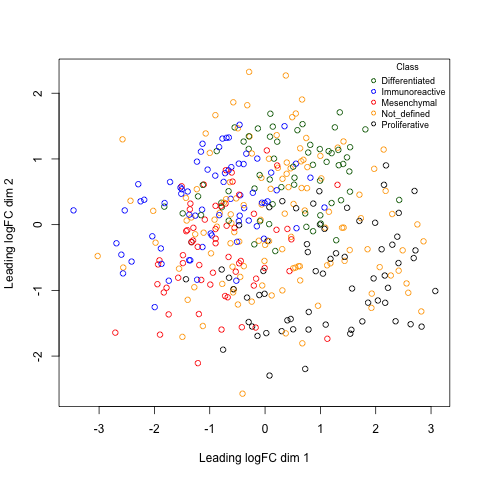
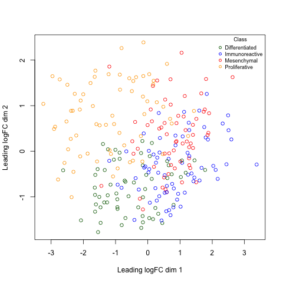

```{r include=FALSE}
library(GEOquery)
library(kableExtra)
library(edgeR)
library(circlize)
library(limma)
```


## Before we start

## Assignment #1 
  * <font size=5> Due Today! @ 20:00 </font>

## What to hand in?
  * **html rendered RNotebook** - you should be able to submit this through quercus
  * Make sure the notebook and all associated code is checked into your github repo as I will be pulling all the repos at the deadline and using them to compile your code. - Your checked in code must replicate the handed in notebook.
  * **Do not check the data file into your repo!** - your code should download the data from GEO and generate a new, cleaned data file.
  * Document your work and your code directly in the notebook.
  * **Read the paper associated with your data!**
  * You are allowed to use helper functions or methods but make sure when you source those files the paths to them are relative and that they are checked into your repo as well. 
  
---
# Differential Gene Expression Analysis

## Where we left off from last week
  * data from "Apoptosis enhancing drugs overcome innate platinum resistance in CA125 negative tumor initiating populations of high grade serous ovarian cancer"
  * 10 ovarian tumours sorted by CA125+ve and -ve antibody
  * we normalized it, we cleaned it, we made sure we had up to date identifers from ensembl.
  * What's next?
  
---

First things first, 
  * Load the data
```{r}
normalized_count_data <- read.table(file=file.path("data", "GSE70072_finalized_normalized_counts.txt"),
                                    header = TRUE,sep = "\t",
                                    stringsAsFactors = FALSE,
                                    check.names=FALSE)
```


---

  * Take a look at the data we just loaded.
```{r}
kable(normalized_count_data[1:5,1:5], type="html")
```

---

Create a numerical matrix that we can create a heatmap from
```{r}
heatmap_matrix <- normalized_count_data[,3:ncol(normalized_count_data)]
rownames(heatmap_matrix) <- normalized_count_data$ensembl_gene_id
colnames(heatmap_matrix) <- colnames(normalized_count_data[,3:ncol(normalized_count_data)])
```

---

### Create a Heatmap

What is a heatmap?
  * data graph that translates numbers into a colour scale over many samples and measurements.
  * Has multiple additional methods that we can use to restructure the format to highlight themes in the data.
```{r message=FALSE, warning=FALSE}
library(ComplexHeatmap)
library(circlize)

if(min(heatmap_matrix) == 0){
    heatmap_col = colorRamp2(c( 0, max(heatmap_matrix)), c( "white", "red"))
  } else {
    heatmap_col = colorRamp2(c(min(heatmap_matrix), 0, max(heatmap_matrix)), c("blue", "white", "red"))
  }

current_heatmap <- Heatmap(as.matrix(heatmap_matrix),
                               show_row_dend = TRUE,
                               show_column_dend = TRUE, 
                               col=heatmap_col,
                               show_column_names = TRUE, 
                               show_row_names = FALSE,
                               show_heatmap_legend = TRUE
                               )
```


---
```{r}
current_heatmap
```
---
Let's try that again using Row - normalization
  * scale each row and centre them around the mean.
  * From each value we subtract the mean and divide by the standard deviation of the row to row normalize it.
  * some other heatmap packages might have row normalization built in.

```{r message=FALSE, warning=FALSE}

heatmap_matrix <- t(scale(t(heatmap_matrix))) #<<

if(min(heatmap_matrix) == 0){
    heatmap_col = colorRamp2(c( 0, max(heatmap_matrix)), c( "white", "red"))
  } else {
    heatmap_col = colorRamp2(c(min(heatmap_matrix), 0, max(heatmap_matrix)), c("blue", "white", "red"))
  }

current_heatmap <- Heatmap(as.matrix(heatmap_matrix),
                               show_row_dend = TRUE,
                               show_column_dend = TRUE, 
                               col=heatmap_col,
                               show_column_names = TRUE, 
                               show_row_names = FALSE,
                               show_heatmap_legend = TRUE
                               )
```

---

```{r }
current_heatmap
```

---
Traditionally, low scale experiments are designed to compare the expression of a single gene or maybe an handful of genes.

```{r}
ca125_pos_samples <- grep(colnames(normalized_count_data),
                          pattern="\\+")
ca125_neg_samples <- grep(colnames(normalized_count_data),
                          pattern="\\-")

gene_of_interest <- which(normalized_count_data$hgnc_symbol == "MUC16")
```

---

.pull-left[
```{r}
muc16_neg_samples <- t(normalized_count_data
                       [gene_of_interest,
                         ca125_neg_samples])
colnames(muc16_neg_samples) <- c("neg_samples")
muc16_neg_samples 
```
]

.pull-right[
```{r}
muc16_pos_samples <- t(normalized_count_data
                       [gene_of_interest,
                         ca125_pos_samples])
colnames(muc16_pos_samples) <- c("pos_samples")
muc16_pos_samples
```
]

---

### Is MUC16 differentially expressed in our samples?

* Using a simple t.test compare this individual gene. 
* The null hypothesis of the two sample t-test is that there is **no** difference in means of each sample
* It assumes that both sample A and sample B are normally distributed.  

```{r}
t.test(x=t(muc16_pos_samples),y=t(muc16_neg_samples))
```

---

.pull-left[
```{r}
muc16_neg_samples <- t(normalized_count_data[gene_of_interest,ca125_neg_samples])
colnames(muc16_neg_samples) <- c("neg_samples")
muc16_neg_samples 
```
]

.pull-right[
```{r}
muc16_pos_samples <- t(normalized_count_data[gene_of_interest,ca125_pos_samples])
colnames(muc16_pos_samples) <- c("pos_samples")
muc16_pos_samples
```
]

???
Obviously it is hard to tell just by looking at the data if the gene is differentially expreseed but there are a lot variables that could explain some of the differences between the samples that are not accounted for in this traditional naive approach.

---

###How can we account for these variables?
* There are many different packages that try and control for these variables.  We are going to go through two of them:
  * [Limma](https://bioconductor.org/packages/release/bioc/html/limma.html) - LInear Models of MircroArray
    * orginallay published in [2004](https://www.ncbi.nlm.nih.gov/pubmed/16646809) for use with microarrays
    * updated and improved over the years to also include rnaseq data.
  * [edgeR](https://bioconductor.org/packages/release/bioc/html/edgeR.html) 
    * Suite of methods specialized for Bulk RNAseq analysis
    * contains multiple methods to compute differential expression including a similar general linear method to the limma package.
  
---

## Limma
  * LInear Models of MircroArray
  * The premise of the limma approach is the use of linear models to define differential expression.
  * **Linear Models** - "describe a continuous response variable as a function of one or more predictor variables."^1
  * Linear regression involves finding an linear model to explain the data.  Often described as fitting a line to a set of data points.
  * for our example, we have a set of measurements and we want to figure out the function that best describes it.
  * Using empirical bayes to compute the odds of any gene being differentially expressed given its contrasts.
  
<font size=2>[1]https://www.mathworks.com/discovery/linear-model.html</font>

---


If you remember from last week we used an MDSPlot to look at how our samples are clustering.  We used the plotMDS from the edgeR package but we can just as easily use the plotMDS function from the the limma package.
```{r}
limma::plotMDS(heatmap_matrix,
               col = rep(c("darkgreen","blue"),10)) #<<
```

---
Another way to look at the exact same plot is to color by patient
```{r}
pat_colors <- rainbow(10)
pat_colors <- unlist(lapply(pat_colors,FUN=function(x){rep(x,2)}))

limma::plotMDS(heatmap_matrix,
               col = pat_colors ) #<<

```

---

## Model
Define the groups
  * From the above plot we know that which samples/patient the data comes from is important to determining its value.
  * We also have hypothesized that CA125 status will also contribute to the differential. 
```{r}
#get the 2 and third token from the column names
samples <- data.frame(
        lapply(colnames(normalized_count_data)[3:22], 
        FUN=function(x){
          unlist(strsplit(x, split = "\\."))[c(2,3)]}))
colnames(samples) <- colnames(normalized_count_data)[3:22]
rownames(samples) <- c("patients","cell_type")
samples <- data.frame(t(samples))
```
```{r}
samples[1:5,]
```

---
### Model - cont'd

* function to create a linear model in R - model.matrix
* creates a design matrix

```{r}
model_design <- model.matrix(~ samples$cell_type)
kable(model_design, type="html")
```

---

Create our data matrix 
  * similar to what we used last week when we were using the edgeR package but slightly different

```{r}
expressionMatrix <- as.matrix(normalized_count_data[,3:22])
rownames(expressionMatrix) <- normalized_count_data$ensembl_gene_id
colnames(expressionMatrix) <- colnames(normalized_count_data)[3:22]
minimalSet <- ExpressionSet(assayData=expressionMatrix)
```

Fit our data to the above model

```{r}
fit <- lmFit(minimalSet, model_design)
```

---

Apply empircal Bayes to compute differential expression for the above described model.
  * The parameter trend=TRUE is specific to RNA-seq data.  (exclude for microarray data)

```{r}
fit2 <- eBayes(fit,trend=TRUE)
```

```{r}
topfit <- topTable(fit2, 
                   coef=ncol(model_design),
                   adjust.method = "BH",
                   number = nrow(expressionMatrix))

#merge hgnc names to topfit table
output_hits <- merge(normalized_count_data[,1:2],
                     topfit,
                     by.y=0,by.x=1,
                     all.y=TRUE)

#sort by pvalue
output_hits <- output_hits[order(output_hits$P.Value),]

```

---

```{r}
kable(output_hits[1:10,],type="html")
```

---
How many gene pass the threshold p-value < 0.05?

```{r}
length(which(output_hits$P.Value < 0.05))
```

How many genes pass correction?
--
```{r}
length(which(output_hits$adj.P.Val < 0.05))
```
---
## Correction?
  * Referring to multipole hypothesis testing.  As the number of tests performed increases the liklihood that a positive results will occur simply by chance increases.  We need to control for this
  * Multiple hypothesis testing will come up for differential expression, pathways analysis and for any analysis where there are multiple tests being performed
  * Control for family-wise error rate or for false discovery rate
  * There are a range of different methods to correct for this:
    1. Bonferonni - considered to be overly stringent by many.  p-values are multiplied by the number of comparisons
    1. Benjamni - hochberg
    1. Benjamini - Yekutieli
    
```{r}
p.adjust.methods
```


---
Can we improve our results if we account for the patient variability?

### Model - cont'd

* function to create a linear model in R - model.matrix
* creates a design matrix

```{r}
model_design_pat <- model.matrix(
  ~ samples$patients + samples$cell_type)
kable(model_design_pat,type="html")
```

---
Fit our data to the above model

```{r}
fit_pat <- lmFit(minimalSet, model_design_pat)
```

---

Apply empircal Bayes to compute differential expression for the above described model.
  * The parameter trend=TRUE is specific to RNA-seq data.  (exclude for microarray data)

```{r}
fit2_pat <- eBayes(fit_pat,trend=TRUE)
```

```{r}
topfit_pat <- topTable(fit2_pat, 
                   coef=ncol(model_design_pat),
                   adjust.method = "BH",
                   number = nrow(expressionMatrix))

#merge hgnc names to topfit table
output_hits_pat <- merge(normalized_count_data[,1:2],
                         topfit_pat,by.y=0,by.x=1,all.y=TRUE)

#sort by pvalue
output_hits_pat <- output_hits_pat[order(output_hits_pat$P.Value),]

```

---

```{r}
kable(output_hits_pat[1:10,],type="html")
```

---

How many gene pass the threshold p-value < 0.05?

```{r}
length(which(output_hits_pat$P.Value < 0.05))
```

How many genes pass correction?
--
```{r}
length(which(output_hits_pat$adj.P.Val < 0.05))
```

---

Compare the results from the two different models

```{r}
simple_model_pvalues <- data.frame(ensembl_id = output_hits$ensembl_gene_id,
                                   simple_pvalue=output_hits$P.Value)
pat_model_pvalues <-  data.frame(ensembl_id = output_hits_pat$ensembl_gene_id,
                                 patient_pvalue = output_hits_pat$P.Value)
two_models_pvalues <- merge(simple_model_pvalues,
                            pat_model_pvalues,by.x=1,by.y=1)

two_models_pvalues$colour <- "black"
two_models_pvalues$colour[two_models_pvalues$simple_pvalue<0.05] <- "orange"
two_models_pvalues$colour[two_models_pvalues$patient_pvalue<0.05] <- "blue"
two_models_pvalues$colour[two_models_pvalues$simple_pvalue<0.05 & two_models_pvalues$patient_pvalue<0.05] <- "red"

```

```{r eval=FALSE}
plot(two_models_pvalues$simple_pvalue,two_models_pvalues$patient_pvalue,
     col = two_models_pvalues$colour,
     xlab = "simple model p-values",
     ylab ="Patient model p-values", 
     main="Simple vs Patient Limma")
```


---

```{r echo=FALSE}
plot(two_models_pvalues$simple_pvalue,two_models_pvalues$patient_pvalue,
     col = two_models_pvalues$colour,
     xlab = "simple model p-values",
     ylab ="Patient model p-values",
     main="Simple vs Patient Limma")
```

---
```{r eval=FALSE}
ensembl_of_interest <- normalized_count_data$ensembl_gene_id[
  which(normalized_count_data$hgnc_symbol == "MUC16")]

two_models_pvalues$colour <- "grey"
two_models_pvalues$colour[two_models_pvalues$ensembl_id==ensembl_of_interest] <- "red"

plot(two_models_pvalues$simple_pvalue,two_models_pvalues$patient_pvalue,
     col = two_models_pvalues$colour,
     xlab = "simple model p-values",
     ylab ="Patient model p-values",
      main="Simple vs Patient Limma")
```

---
```{r echo=FALSE}
ensembl_of_interest <- normalized_count_data$ensembl_gene_id[
  which(normalized_count_data$hgnc_symbol == "MUC16")]

two_models_pvalues$colour <- "grey"
two_models_pvalues$colour[two_models_pvalues$ensembl_id==ensembl_of_interest] <- "red"

plot(two_models_pvalues$simple_pvalue,two_models_pvalues$patient_pvalue,
     col = two_models_pvalues$colour,
     xlab = "simple model p-values",
     ylab ="Patient model p-values",
      main="Simple vs Patient Limma")
```


---
let's come back to the initial heatmap representation of the data
```{r}

top_hits <- output_hits_pat$ensembl_gene_id[output_hits_pat$P.Value<0.05]
heatmap_matrix_tophits <- t(
  scale(t(heatmap_matrix[
    which(rownames(heatmap_matrix) %in% top_hits),]))) #<<

if(min(heatmap_matrix_tophits) == 0){
    heatmap_col = colorRamp2(c( 0, max(heatmap_matrix_tophits)), 
                             c( "white", "red"))
  } else {
    heatmap_col = colorRamp2(c(min(heatmap_matrix_tophits), 0, max(heatmap_matrix_tophits)), c("blue", "white", "red"))
  }

current_heatmap <- Heatmap(as.matrix(heatmap_matrix_tophits),
                           cluster_rows = TRUE,
                           cluster_columns = TRUE,
                               show_row_dend = TRUE,
                               show_column_dend = TRUE, 
                               col=heatmap_col,
                               show_column_names = TRUE, 
                               show_row_names = FALSE,
                               show_heatmap_legend = TRUE,
                               )
```

???
scale is a generic function that centres of scales the columns of a numeric matrix

---
Heatmap of top hits using Limma (accounting for patient variability) - 
  * p-value < 0.05
```{r}
current_heatmap
```


---

```{r}

heatmap_matrix_tophits<- heatmap_matrix_tophits[, 
                     c(                    
                     grep(colnames(heatmap_matrix_tophits),pattern = "\\+"),                            grep(colnames(heatmap_matrix_tophits),pattern = "\\-")
                      )]

if(min(heatmap_matrix_tophits) == 0){
    heatmap_col = colorRamp2(c( 0, max(heatmap_matrix_tophits)), 
                             c( "white", "red"))
  } else {
    heatmap_col = colorRamp2(c(min(heatmap_matrix_tophits), 0, max(heatmap_matrix_tophits)), c("blue", "white", "red"))
  }

current_heatmap <- Heatmap(as.matrix(heatmap_matrix_tophits),
                           cluster_rows = TRUE,
                           cluster_columns = FALSE, #<<
                               show_row_dend = TRUE,
                               show_column_dend = TRUE, 
                               col=heatmap_col,
                               show_column_names = TRUE, 
                               show_row_names = FALSE,
                               show_heatmap_legend = TRUE,
                               )
```

---

```{r echo=FALSE}
current_heatmap
```

???
As we saw from the MDS plot the separation between my samples is not great.  We can try and correct for that but unfortunately, there is only so much that will help.

---
Try for a slightly cleaner picture.
```{r}

top_hits <- output_hits_pat$ensembl_gene_id[output_hits_pat$P.Value<0.01] #<<
heatmap_matrix_tophits <- t(
  scale(t(heatmap_matrix[which(rownames(heatmap_matrix) %in% top_hits),]))) 

heatmap_matrix_tophits<- heatmap_matrix_tophits[,
       c(grep(colnames(heatmap_matrix_tophits),pattern = "\\+"),                            grep(colnames(heatmap_matrix_tophits),pattern = "\\-"))]

if(min(heatmap_matrix_tophits) == 0){
    heatmap_col = colorRamp2(c( 0, max(heatmap_matrix_tophits)), 
                             c( "white", "red"))
  } else {
    heatmap_col = colorRamp2(c(min(heatmap_matrix_tophits), 0, max(heatmap_matrix_tophits)), c("blue", "white", "red"))
  }

current_heatmap <- Heatmap(as.matrix(heatmap_matrix_tophits),
                  cluster_rows = TRUE,  show_row_dend = TRUE,
                  cluster_columns = FALSE,show_column_dend = FALSE, #<<
                  col=heatmap_col,show_column_names = TRUE, 
                  show_row_names = FALSE,show_heatmap_legend = TRUE)
```

---
Heatmap of top hits using Limma (accounting for patient variability) - 
  * p-value < 0.05
  * Columns ordered by cell type.
```{r echo=FALSE}
current_heatmap
```

---

### EdgeR
  * Analysis package designed for the processing of RNASeq data.
  * Interestingly, the Limma guide direct users to use edgeR up to the point of calculating differential expression.
  * And limma and edgeR are all written by the same people though...
  * There are many different models available in edgeR that can be used for differential expression.
    * exactTest - used for models that only have one factor
    * Quasi liklihood - used for more complicated models and is highly recommended for bulk RNASeq experiments. (glmQLFTest)
    * liklihood ratio test - can be useful for some experiments with limit number of samples or single sample RNA Seq.. (glmLRTest)
    
---

Review from last class: Set up our edgeR objects

```{r message=FALSE, warning=FALSE, include=FALSE}
library(GEOquery)
sfiles = getGEOSuppFiles('GSE70072')

fnames = rownames(sfiles)

# there is only one supplemental file
ca125_exp = read.delim(fnames[1],header=TRUE,
                check.names = FALSE) 

cpms = edgeR::cpm(ca125_exp[,3:22])
rownames(cpms) <- ca125_exp[,1]

# get rid of low counts
keep = rowSums(cpms >1) >=3  #<<
ca125_exp_filtered = ca125_exp[keep,]

filtered_data_matrix <- as.matrix(ca125_exp_filtered[,3:22])
rownames(filtered_data_matrix) <- ca125_exp_filtered$ensembl75_id


```

```{r}
d = DGEList(counts=filtered_data_matrix, group=samples$cell_type)
```

--

Estimate Dispersion - our model design. 

```{r}
d <- estimateDisp(d, model_design_pat)
```


--

Fit the model

```{r}
fit <- glmQLFit(d, model_design_pat)
```

---

```{r}
kable(model_design_pat[1:10,1:5], type="html") %>%
  row_spec(0, angle = -45)
```


---

Calculate differential expression using the Quasi liklihood model

```{r}
qlf.pos_vs_neg <- glmQLFTest(fit, coef='samples$cell_typeCA125+')
kable(topTags(qlf.pos_vs_neg), type="html")
```


---

Get all the results
```{r}
qlf_output_hits <- topTags(qlf.pos_vs_neg,sort.by = "PValue",
                           n = nrow(normalized_count_data))
```


How many gene pass the threshold p-value < 0.05?

```{r}
length(which(qlf_output_hits$table$PValue < 0.05))
```

How many genes pass correction?
--
```{r}
length(which(qlf_output_hits$table$FDR < 0.05))
```

---
Compare the results from the two different models
  * Limma vs Quasi liklihood

```{r}
qlf_pat_model_pvalues <- data.frame(
          ensembl_id = rownames(qlf_output_hits$table),
          qlf_patient_pvalue=qlf_output_hits$table$PValue)
limma_pat_model_pvalues <-  data.frame(
          ensembl_id = output_hits_pat$ensembl_gene_id,
          limma_patient_pvalue = output_hits_pat$P.Value)
two_models_pvalues <- merge(qlf_pat_model_pvalues,
                            limma_pat_model_pvalues,
                            by.x=1,by.y=1)

two_models_pvalues$colour <- "black"
two_models_pvalues$colour[two_models_pvalues$qlf_patient_pvalue<0.05] <- "orange"
two_models_pvalues$colour[two_models_pvalues$limma_patient_pvalue<0.05] <- "blue"
two_models_pvalues$colour[two_models_pvalues$qlf_patient_pvalue<0.05 & two_models_pvalues$limma_patient_pvalue<0.05] <- "red"

```

```{r eval=FALSE}
plot(two_models_pvalues$qlf_patient_pvalue,
     two_models_pvalues$limma_patient_pvalue,
     col = two_models_pvalues$colour,
     xlab = "QLF patient model p-values",
     ylab ="Limma Patient model p-values",
     main="QLF vs Limma")
```


---

```{r echo=FALSE}
plot(two_models_pvalues$qlf_patient_pvalue,
     two_models_pvalues$limma_patient_pvalue,
     col = two_models_pvalues$colour,
     xlab = "QLF patient model p-values",
     ylab ="Limma Patient model p-values",
     main="QLF vs Limma")
```

---
```{r eval=FALSE}
ensembl_of_interest <- normalized_count_data$ensembl_gene_id[
  which(normalized_count_data$hgnc_symbol == "MUC16")]

two_models_pvalues$colour <- "grey"
two_models_pvalues$colour[two_models_pvalues$ensembl_id==ensembl_of_interest] <- "red"

plot(two_models_pvalues$qlf_patient_pvalue,
     two_models_pvalues$limma_patient_pvalue,
     col = two_models_pvalues$colour,
     xlab = "QLF patient model p-values",
     ylab ="Limma Patient model p-values",
     main="QLF vs Limma")

points(two_models_pvalues[ #<<
  two_models_pvalues$ensembl_id==ensembl_of_interest,2:3], #<<
       pch=24,  col="red", cex=1.5) #<<


```

---
```{r echo=FALSE}
ensembl_of_interest <- normalized_count_data$ensembl_gene_id[
  which(normalized_count_data$hgnc_symbol == "MUC16")]

two_models_pvalues$colour <- "grey"
two_models_pvalues$colour[two_models_pvalues$ensembl_id==ensembl_of_interest] <- "red"

plot(two_models_pvalues$qlf_patient_pvalue,
     two_models_pvalues$limma_patient_pvalue,
     col = two_models_pvalues$colour,
     xlab = "QLF patient model p-values",
     ylab ="Limma Patient model p-values",
     main="QLF vs Limma")


points(two_models_pvalues[ #<<
  two_models_pvalues$ensembl_id==ensembl_of_interest,2:3], #<<
       pch=24,  col="red", cex=1.5) #<<

```


---
let's come back to the initial heatmap representation of the data
```{r}

top_hits <- rownames(qlf_output_hits$table)[output_hits_pat$P.Value<0.05] #<<
heatmap_matrix_tophits <- t(
  scale(t(heatmap_matrix[which(rownames(heatmap_matrix) %in% top_hits),]))) #<<

if(min(heatmap_matrix_tophits) == 0){
    heatmap_col = colorRamp2(c( 0, max(heatmap_matrix_tophits)), 
                             c( "white", "red"))
  } else {
    heatmap_col = colorRamp2(c(min(heatmap_matrix_tophits), 0, max(heatmap_matrix_tophits)), c("blue", "white", "red"))
  }

current_heatmap <- Heatmap(as.matrix(heatmap_matrix_tophits),
                           cluster_rows = TRUE,
                           cluster_columns = TRUE,
                               show_row_dend = TRUE,
                               show_column_dend = TRUE, 
                               col=heatmap_col,
                               show_column_names = TRUE, 
                               show_row_names = FALSE,
                               show_heatmap_legend = TRUE,
                               )
```

???
scale is a generic function that centres of scales the columns of a numeric matrix

---
Heatmap of top hits using the Quasi liklihood model (p-value < 0.05)
```{r}
current_heatmap
```

---

Sort the columns by cell type.
```{r}

top_hits <- rownames(qlf_output_hits$table)[output_hits_pat$P.Value<0.05] 
heatmap_matrix_tophits <- t(
  scale(t(heatmap_matrix[which(rownames(heatmap_matrix) %in% top_hits),]))) 

heatmap_matrix_tophits<- heatmap_matrix_tophits[,
       c(grep(colnames(heatmap_matrix_tophits),pattern = "\\+"),                            grep(colnames(heatmap_matrix_tophits),pattern = "\\-"))] #<<

if(min(heatmap_matrix_tophits) == 0){
    heatmap_col = colorRamp2(c( 0, max(heatmap_matrix_tophits)), 
                             c( "white", "red"))
  } else {
    heatmap_col = colorRamp2(c(min(heatmap_matrix_tophits), 0, max(heatmap_matrix_tophits)), c("blue", "white", "red"))
  }

current_heatmap <- Heatmap(as.matrix(heatmap_matrix_tophits),
                           cluster_rows = TRUE,
                           cluster_columns = FALSE, #<<
                               show_row_dend = TRUE,
                               show_column_dend = FALSE, #<< 
                               col=heatmap_col,
                               show_column_names = TRUE, 
                               show_row_names = FALSE,
                               show_heatmap_legend = TRUE,
                               )
```

---
Heatmap of top hits using the Quasi liklihood model (p-value < 0.05)
  * sort columns according to cell type
```{r}
current_heatmap
```


---

## The Cancer Genome Atlas (TCGA)


???
Currently hosted data on the GDC - Genome data commons
Some of the data is open access - data is not traceable to individual patient
Some of the data is restricted and you need to apply to get it
Sequnces - 20,000 cancer samples in depth - RNASeq, Microarray, microRNA, CNV , methylation SNP ...

---
## Get TCGA OV data
```{r message=FALSE, warning=FALSE}
library(TCGAbiolinks)
library("SummarizedExperiment")
```

* Get the counts data 
```{r}
query_counts <- GDCquery(project = "TCGA-OV", 
                   data.category = "Transcriptome Profiling",
                   data.type = "Gene Expression Quantification",
                   experimental.strategy = "RNA-Seq",
                   workflow.type = "HTSeq - Counts" ,
                   legacy = FALSE) #<<
 GDCdownload(query_counts)
 OVRnaseqSE_counts <- GDCprepare(query_counts)
```


---
## TCGA Biolinks
[TCGABiolink](https://bioconductor.org/packages/release/bioc/html/TCGAbiolinks.html) - docker image!


---
## Ovarian Cancer - TCGA data
### Of note, Output from the GDCprepare: 
  * GDCquery: Searching in GDC database
    * Genome of reference: hg38
  * Accessing GDC. This might take a while...
  * Project: TCGA-OV
  * Filtering results
    * By experimental.strategy
    * By data.type
    * By workflow.type
  * Checking data
    * Check if there are duplicated cases
    * Check if there results for the query
  *  Preparing output
    * Downloading data for project TCGA-OV
    * GDCdownload will download '''379''' files. A total of 97.709866 MB
    * Downloading as: Mon_Feb__3_20_24_38_2020.tar.gz
---

### Of note, Output from the GDCprepare: Cont'd 

Starting to add information to samples
    * Add clinical information to samples
 
Add FFPE information. More information at: 
    * https://cancergenome.nih.gov/cancersselected/biospeccriteria 
    * http://gdac.broadinstitute.org/runs/sampleReports/latest/FPPP_FFPE_Cases.html
    * Adding subtype information to samples

Accessing www.ensembl.org to get gene information
    * Downloading genome information (try:0) Using: Human genes (GRCh38.p13)
From the 60483 genes we couldn't map 3984"

---

## Experimental Design?

--


<font size=2>Verhaak el al. Cancer Genome Atlas Research Network. Prognostically relevant gene signatures of high-grade serous ovarian carcinoma. J Clin Invest. 2013 Jan;123(1):517-25.[PMID](https://www.ncbi.nlm.nih.gov/pubmed/23257362)</font>


---

Load in the predefined classes as described in the Verhaak et al paper.

```{r}
classDefinitions_RNASeq <- read.table( 
  file.path("data", "Supplementary_Table11_RNASeq_classdefinitions.txt"), 
  header = TRUE, sep = "\t", quote="\"", stringsAsFactors = FALSE)

tcga.read.counts <- assay(OVRnaseqSE_counts)
colnames(tcga.read.counts) <- gsub(colnames(tcga.read.counts),
                                   pattern = "-",replacement = "\\.")
```

How many of the samples in the Verhaak paper are in out TCGA data

--
```{r}
length(which(classDefinitions_RNASeq$patient %in% colnames(tcga.read.counts)))
```

---

Add the missing samples to the class definitions table
```{r}

missing_patients <- colnames(tcga.read.counts)[
  which(!colnames(tcga.read.counts) %in% classDefinitions_RNASeq$patient)]

missing_subtypes <- data.frame(barcode = substring(missing_patients,1,12),
                               patient =missing_patients , 
                               SUBTYPE = "Not_defined")
classDefinitions_RNASeq <- rbind(classDefinitions_RNASeq,
                                missing_subtypes )
classDefinitions_RNASeq <- classDefinitions_RNASeq[
  which(classDefinitions_RNASeq$patient %in% colnames(tcga.read.counts)),]

classDefinitions_RNASeq <- classDefinitions_RNASeq[order(classDefinitions_RNASeq$patient),]
tcga.read.counts <- tcga.read.counts[,order(colnames(tcga.read.counts))]
```


---
filter the data

```{r}
cpms <- cpm(tcga.read.counts)
keep <- rowSums(cpms > 1) >= 50
counts <- tcga.read.counts[keep,]
```

--
Normalize the data
```{r}
# create data structure to hold counts and subtype information for each sample.
d <- DGEList(counts=counts, group=classDefinitions_RNASeq$SUBTYPE)

#Normalize the data
d <- calcNormFactors(d)
```

---
Plot MDS plot of samples
```{r}

mds_filename <- file.path("data", "mdsplot_allsamples.png")
png(filename = mds_filename)
mds_output <- plotMDS(d, labels=NULL, pch = 1, 
col= c("darkgreen","blue","red", "orange","black")[factor(classDefinitions_RNASeq$SUBTYPE)])


legend("topright", 
       legend=levels(factor(classDefinitions_RNASeq$SUBTYPE)), 
       pch=c(1), col= c("darkgreen","blue","red", "orange","black"),
       title="Class",  
       bty = 'n', cex = 0.75)

dev.off()
```

---



---

At this stage I am going to reduce the samples to only the ones we have subtype information for.

```{r}
keep_samples <- classDefinitions_RNASeq$patient[
  classDefinitions_RNASeq$SUBTYPE != "Not_defined"]

classDefinitions_RNASeq <- classDefinitions_RNASeq[  classDefinitions_RNASeq$SUBTYPE != "Not_defined",]
counts <- counts[,keep_samples]
```

Normalize the data
```{r}
# create data structure to hold counts and subtype information for each sample.
d <- DGEList(counts=counts, group=classDefinitions_RNASeq$SUBTYPE)

#Normalize the data
d <- calcNormFactors(d)
```


---
Plot MDS plot of samples
```{r}

mds_filename <- file.path("data", "mdsplot_allsamples_minus_undef.png")
png(filename = mds_filename)
mds_output <- plotMDS(d, labels=NULL, pch = 1, 
col= c("darkgreen","blue","red", "orange","black")[factor(classDefinitions_RNASeq$SUBTYPE)])


legend("topright", 
       legend=levels(factor(classDefinitions_RNASeq$SUBTYPE)), 
       pch=c(1), col= c("darkgreen","blue","red", "orange"),
       title="Class",  
       bty = 'n', cex = 0.75)

dev.off()
```

---



---


Define the model matrix
```{r}
classes <- classDefinitions_RNASeq$SUBTYPE
model_design_tcga <- model.matrix(~ 0 + classes)
model_design_tcga[1:5,1:4]
```

---

Calculate dispersion

```{r}
d <- estimateDisp(d,model_design_tcga)
```


---
Graphing the BCV
  * tagwise = genewise, each dot represents the BCV for a gene
```{r}
plotBCV(d,col.tagwise = "black",col.common = "red")
```

---

```{r message=FALSE, warning=FALSE}
plotMeanVar(d, show.raw.vars = TRUE, show.tagwise.vars=TRUE, 
            show.ave.raw.vars = TRUE,  
            NBline=TRUE, #<< 
            show.binned.common.disp.vars = TRUE)
```


---

Calculate differential expression
  * We have a lot of different option to look at here - Immuno subtype vs mesenchymal
```{r}
contrast_mesenvsimmuno <- makeContrasts(
                  mesenvsimmuno ="classesMesenchymal-classesImmunoreactive",
                  levels=model_design_tcga)

contrast_mesenvsimmuno
```


---
```{r}
fit_qlf_tcga <-glmQLFit (d,model_design_tcga)

qlf.immuno_vs_mesechymal <- glmQLFTest(fit_qlf_tcga, 
                                       contrast=contrast_mesenvsimmuno)

tt_mesenvsimmuno <- topTags(qlf.immuno_vs_mesechymal,n=nrow(d))

```


---
top hits
```{r}
#merge in the gene names first
ovRNASeq_gene_countsdata <- rowData(OVRnaseqSE_counts)

data_display <- merge(ovRNASeq_gene_countsdata[,1:2],
                      topTags(qlf.immuno_vs_mesechymal),
                      by.x=1, by.y = 0)

kable(data_display, type="html")
```

---

```{r}
kable(data_display, type="html",digits = 32)
```


---

How many genes have p-values less than 0.05
--

```{r}
length(which(tt_mesenvsimmuno$table$PValue<0.05))
```

How many genes pass correction?
--
```{r}
length(which(tt_mesenvsimmuno$table$FDR < 0.05))
```

---
Try a different comparison:
  * compare immuno to the rest of the samples (not undefined though)
```{r}
contrast_immuno <- makeContrasts(
  immunovsrest ="classesImmunoreactive-(classesMesenchymal + 
  classesProliferative +classesDifferentiated)/3",
  levels=model_design_tcga)

qlf.immuno_vs_all <- glmQLFTest(fit_qlf_tcga, 
                                       contrast=contrast_immuno)

tt_immunovsall <- topTags(qlf.immuno_vs_all,n=nrow(d))
```

---

How many genes have p-values less than 0.05
--

```{r}
length(which(tt_immunovsall$table$PValue<0.05))
```

How many genes pass correction?
--
```{r}
length(which(tt_immunovsall$table$FDR < 0.05))
```

---

Visualize this data set

```{r}
# get the normalized counts
tcga_normalized_counts <- log2(cpm(d) +1)

#create the scaled heatmap object
heatmap_matrix <- tcga_normalized_counts

top_hits <- rownames(tt_immunovsall)[which(tt_immunovsall$table$FDR < 0.001)] #<<
heatmap_matrix_tophits <- t(
  scale(t(heatmap_matrix[which(rownames(heatmap_matrix) %in% top_hits),]))) 

if(min(heatmap_matrix_tophits) == 0){
    heatmap_col = colorRamp2(c( 0, max(heatmap_matrix_tophits)), 
                             c( "white", "red"))
  } else {
    heatmap_col = colorRamp2(c(min(heatmap_matrix_tophits), 0, max(heatmap_matrix_tophits)), c("blue", "white", "red"))
  }

current_heatmap <- Heatmap(as.matrix(heatmap_matrix_tophits),
                  cluster_rows = TRUE,  show_row_dend = TRUE,
                  cluster_columns = TRUE,show_column_dend = FALSE, #<<
                  col=heatmap_col,show_column_names = FALSE, 
                  show_row_names = FALSE,show_heatmap_legend = TRUE)

```


---
Immuno vs Rest heatmap

```{r echo=FALSE}
current_heatmap
```

---

Annotating the heatmap could really help here.
```{r}
ha_colours <- c("darkgreen","blue","red", "orange")
names(ha_colours) <- unique(classDefinitions_RNASeq$SUBTYPE)

ha <- HeatmapAnnotation(df=data.frame(
  type = classDefinitions_RNASeq$SUBTYPE),
  col =  list(type = ha_colours))

current_heatmap <- Heatmap(as.matrix(heatmap_matrix_tophits),
                  cluster_rows = TRUE,  show_row_dend = TRUE,
                  cluster_columns = TRUE,show_column_dend = FALSE,
                  col=heatmap_col,show_column_names = FALSE, 
                  show_row_names = FALSE,show_heatmap_legend = TRUE,
                  top_annotation = ha) #<<

```

---
Immuno vs Rest heatmap - annotated

```{r echo=FALSE}
current_heatmap
```


---
## Homework for next week

Next week we will be looking at "What do we do with all these hits?"

  * Find an annotation data set (excluding GO and Reactome) for human genes.
  * Any data set that adds functional, process or location data to a set of genes.
  * Record in your journal and add it to the list of annotation sources on the Student Wiki:
    * When was it published?  Was is published?
    * How is it released? What identifiers does it use?
    * What sort of information does it offer us? 
    


