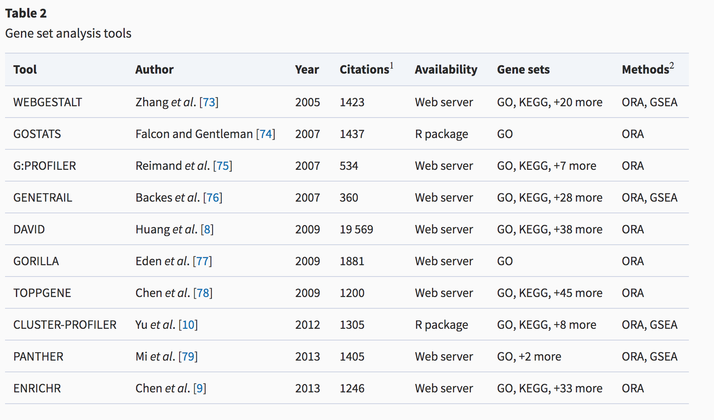
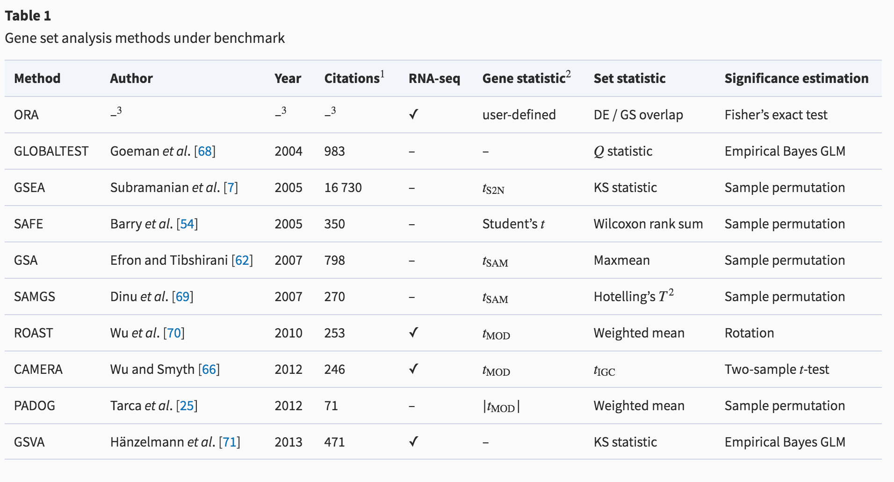

## Before we start

It is not too late to fill this out (If you haven't filled this out yet please do):


[<font size=8>Mid course Feedback : https://forms.gle/maGA529V7pxvgBXC6</font>](https://forms.gle/maGA529V7pxvgBXC6)

---
class: left
# Journal (Clarifications)

* **Main purpose** : to develop good habits. 
* Things to remember:
  * Often the person we are writing notes for is our future selves when we revisit a project, need to write up all the details of a given project for publication.
  * data transformations, parameters, code version are good details to include.
  * Errors that you encountered and how you fixed them! **They will come up again.  I guarentee it!**
  * See [journal course prepratory material](https://bcb420-2020.github.io/General_course_prep/journal.html) for more details and template of a journal entry. 

* What should be in your journal? (minimally:)
    * Plaigarism unit
    * work associated with Assignment
    * attempts at using docker
    * annotation source homework
    * gprofiler homework
    * any future homework
    * If there are assigned readings - enter your notes on the article as a journal entry.

---


---


---


---


---


---


---


---


---


---


---


---


---


---


---



<font size=2>Geistlinger L, Csaba G, Santarelli M, Ramos M, Schiffer L, Turaga N, Law C,Davis S, Carey V, Morgan M, Zimmer R, Waldron L. Toward a gold standard for
benchmarking gene set enrichment analysis. Brief Bioinform. 2020 Feb 6 [PMID](https://www.ncbi.nlm.nih.gov/pubmed/32026945)</font>


---

## Homework from last week

Use this list of genes:[genelist.txt](https://github.com/bcb420-2020/Student_Wiki/blob/master/genelist.txt) as your query set and run a [g:profiler](https://biit.cs.ut.ee/gprofiler/gost) enrichment analysis with the following parameters:

1.Data sources : Reactome, Go biologoical process, and Wiki pathways
1.Multiple hypothesis testing - Benjamini hochberg

Answer the questions below:
1. What is the top term returned in each data source?
1. How many genes are in each of the above genesets returned? 
1. How many genes from our query are found in the above genesets?
1. Change g:profiler settings so that you limit the size of the returned genesets. Make sure the returned genesets are between 5 and 200 genes in size. Did that change the results?
1. Which of the 4 ovarian cancer expression subtypes do you think this list represents?
1. **Bonus**: The top gene returned for this comparison is TFEC (ensembl gene id:ENSG00000105967). Is it found annotated in any of the pathways returned by g:profiler for our query? What terms is it associated with in g:profiler?

---
#Let's go through the answers

[<font size=8>www.kahoot.it</font>](www.kahoot.it) 

---

**Bonus**: The top gene returned for this comparison is TFEC (ensembl gene id:ENSG00000105967). Is it found annotated in any of the pathways returned by g:profiler for our query? What terms is it associated with in g:profiler?

---


---


---


---


---


---


---


---


---


---


---


---


---
## Bader lab genesets

[http://download.baderlab.org/EM_Genesets/](http://download.baderlab.org/EM_Genesets/)

* Automatically download the latest geneset file for your analysis

---

```{r download baderlab gmt file, eval=FALSE,tidy=TRUE}
gmt_url = "http://download.baderlab.org/EM_Genesets/current_release/Human/symbol/"

#list all the files on the server
filenames = getURL(gmt_url)
tc = textConnection(filenames)
contents = readLines(tc)
close(tc)

#get the gmt that has all the pathways and does not include terms inferred from electronic annotations(IEA) start with gmt file that has pathways only
rx = gregexpr("(?<=<a href=\")(.*.GOBP_AllPathways_no_GO_iea.*.)(.gmt)(?=\">)",
  contents, perl = TRUE)
gmt_file = unlist(regmatches(contents, rx))

dest_gmt_file <- file.path(data_dir, gmt_file )

download.file(paste(gmt_url,gmt_file,sep=""),
    destfile=dest_gmt_file)
```

---



<font size=2>Geistlinger L, Csaba G, Santarelli M, Ramos M, Schiffer L, Turaga N, Law C,Davis S, Carey V, Morgan M, Zimmer R, Waldron L. Toward a gold standard for
benchmarking gene set enrichment analysis. Brief Bioinform. 2020 Feb 6 [PMID](https://www.ncbi.nlm.nih.gov/pubmed/32026945)</font>

---
## Running and Exploring GSEA

---

## Assignment #2 
  * differentail gene expression and preliminary ORA 
  * <font size=5> Due March 3, 2020! @ 20:00 </font>

## What to hand in?
  * **html rendered RNotebook** - you should submit this through quercus
  * Make sure the notebook and all associated code is checked into your github repo as I will be pulling all the repos at the deadline and using them to compile your code. - Your checked in code must replicate the handed in notebook.
  * Document your work and your code directly in the notebook.
  * **Reference the paper associated with your data!**
  * **Introduce your paper and your data again** 
  * You are allowed to use helper functions or methods but make sure when you source those files the paths to them are relative and that they are checked into your repo as well. 
  


---
## Homework for next week

Practise using GSEA.
Given the ranked list comparing mesenchymal and immunoreactive ovarian cancer (mesenchymal genes have positive scores, immunoreactive have negative scores).  perform a GSEA preranked analysis using the following parameters:
  * genesets from the baderlab geneset collection from February 1, 2020 containing GO biological process, no IEA and pathways.
  * maximum geneset size of 200
  * minimum geneset size of 15
  * gene set permutation

and answer the following questions in your journal:
  1. What is the top gene set returned for the Mesenchymal sub type?  What is the top gene set returned for the Immunoreactive subtype?
  1. What is its pvalue, ES, NES and FDR associated with it.
  1.  How many genes in its leading edge?
  1. What is the top gene associated with this geneset
  
    
